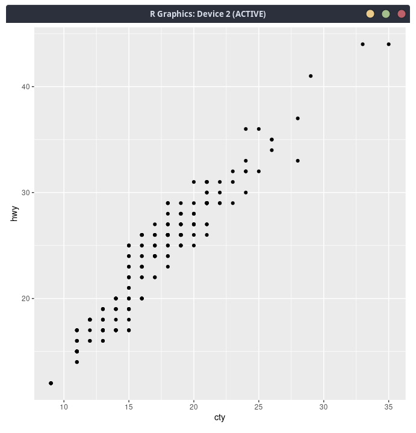
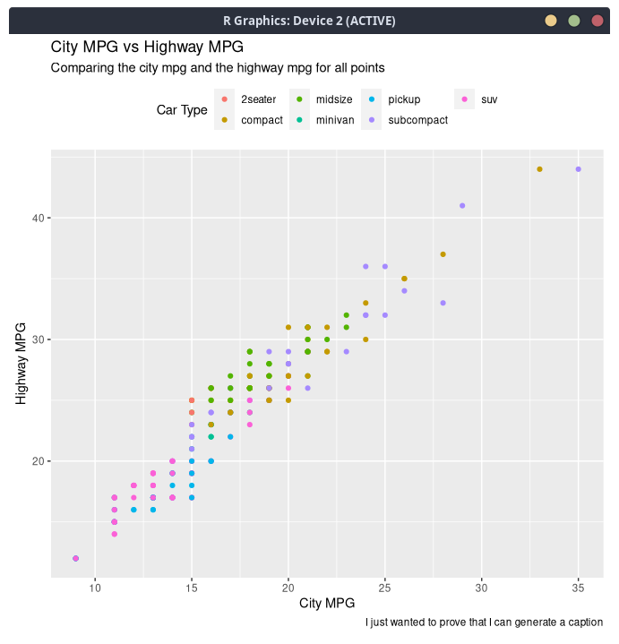
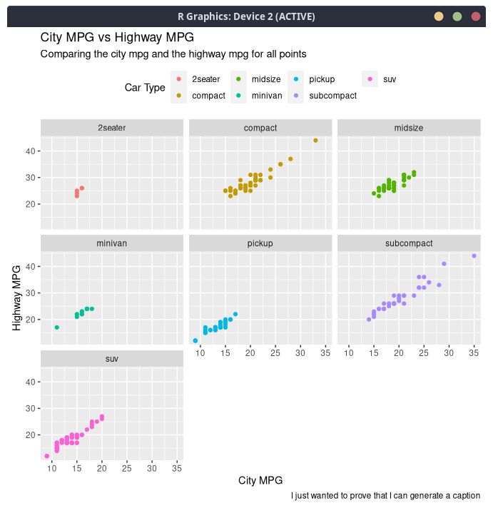
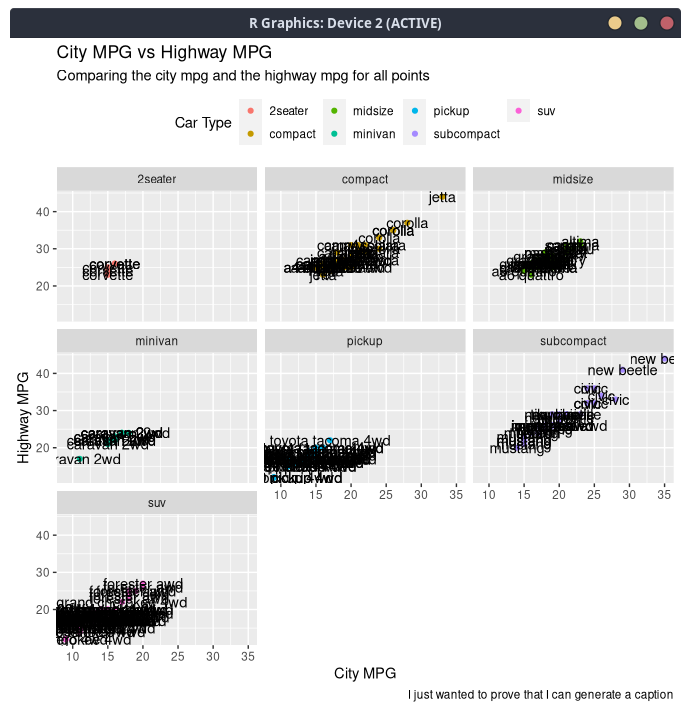
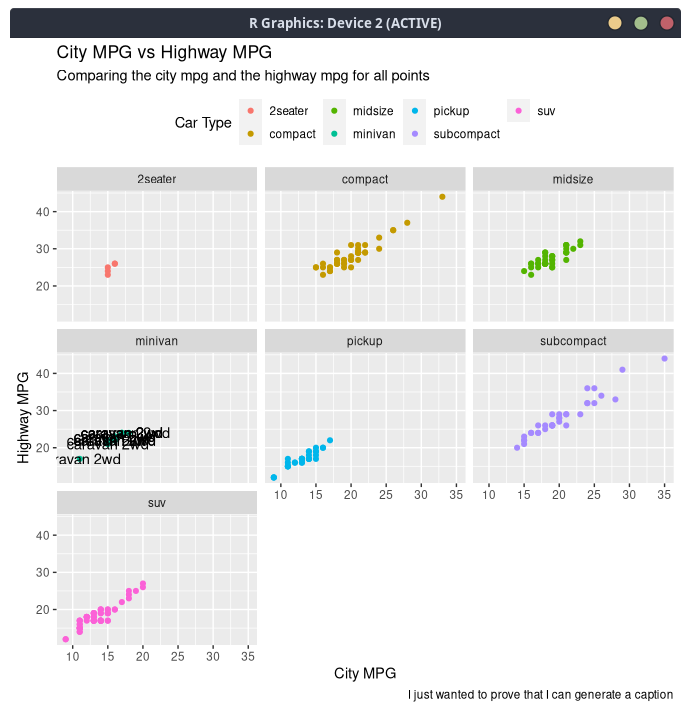
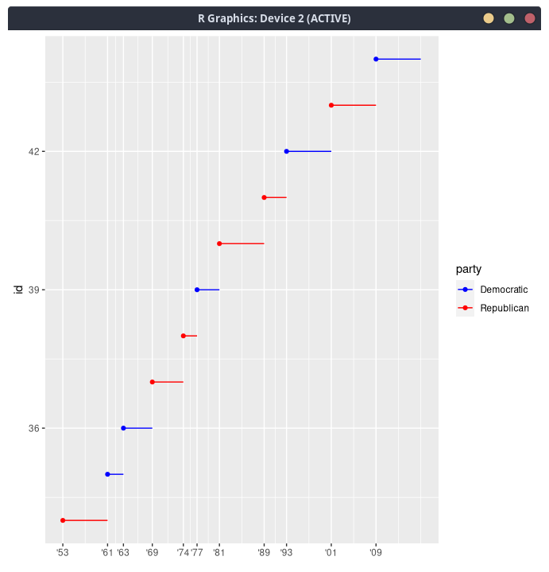
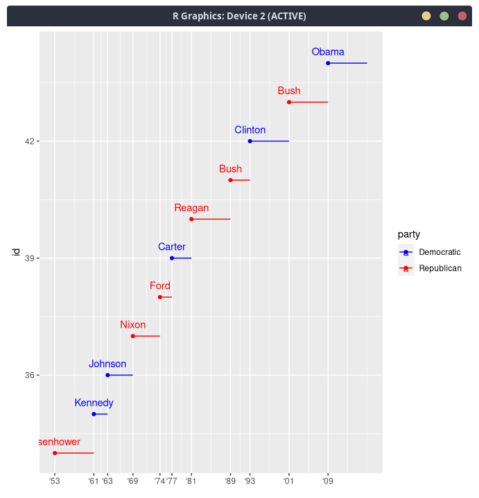

#
# Section 28.2.1 

## 3. Take an exploratory graphic that you’ve created in the last month, and add informative titles to make it easier for others to understand.

    I have chosen to do the first graph we have done in this class

```R
ggplot(data = mpg) + geom_point(mapping = aes(x = manufacturer, y = hwy))
```



```R
ggplot(data = mpg) + 
geom_point(mapping = aes(x = cty, y = hwy, color=class)) +
labs(
    title = "City MPG vs Highway MPG",
    subtitle = "Comparing the city mpg and the highway mpg for all points",
    caption = "I just wanted to prove that I can generate a caption",
    x="City MPG",
    y="Highway MPG",
    color="Car Type"
) +
theme(
    legend.position = "top"
) 

```


<div style="page-break-after: always"></div>

#
# Section 28.3.1 

## 3. How do labels with geom_text() interact with faceting? How can you add a label to a single facet? How can you put a different label in each facet? (Hint: think about the underlying data.)

    I decided to facet the above graph

```
ggplot(data = mpg) + 
geom_point(mapping = aes(x = cty, y = hwy, color=class)) +
labs( title = "City MPG vs Highway MPG", subtitle = "Comparing the city mpg and the highway mpg for all points", caption = "I just wanted to prove that I can generate a caption", x="City MPG",y="Highway MPG", color="Car Type") +
theme(legend.position = "top") + 
facet_wrap(~class) 
```



    If I add text it will impact the entire graph 

```R
ggplot(data = mpg) + 
geom_point(mapping = aes(x = cty, y = hwy, color=class)) +
labs(
    title = "City MPG vs Highway MPG",
    subtitle = "Comparing the city mpg and the highway mpg for all points",
    caption = "I just wanted to prove that I can generate a caption",
    x="City MPG",
    y="Highway MPG",
    color="Car Type"
) +
theme(
    legend.position = "top"
) + 
geom_text(data=mpg, mapping=aes(x = cty, y = hwy, label=model))+
facet_wrap(~class)
```



    so if I want to make sure it only impacts one facet we will simply trim the data and overwrite my data in the geom_text

``` R
yehaw <- mpg %>%
filter(class=="minivan")

ggplot(data = mpg) + 
geom_point(mapping = aes(x = cty, y = hwy, color=class)) +
labs(
    title = "City MPG vs Highway MPG",
    subtitle = "Comparing the city mpg and the highway mpg for all points",
    caption = "I just wanted to prove that I can generate a caption",
    x="City MPG",
    y="Highway MPG",
    color="Car Type"
) +
theme(
    legend.position = "top"
) + 
geom_text(data=yehaw, mapping=aes(x = cty, y = hwy, label=model))+
facet_wrap(~class)
```



<div style="page-break-after: always"></div>

#
# Section 28.4.4 

## 3. Change the display of the presidential terms by:

```R
presidential %>%
  mutate(id = 33 + row_number()) %>%
  ggplot(aes(start, id)) +
    geom_point() +
    geom_segment(aes(xend = end, yend = id)) +
    scale_x_date(NULL, breaks = presidential$start, date_labels = "'%y")


presidential %>%
  mutate(id = 33 + row_number()) %>%
  ggplot(aes(start, id, colour = party)) +
    geom_point() +
    geom_segment(aes(xend = end, yend = id)) +
    scale_colour_manual(values = c(Republican = "red", Democratic = "blue"))
```

### 1. Combining the two variants shown above.

```R
presidential %>%
  mutate(id = 33 + row_number()) %>%
  ggplot(aes(start, id, colour = party)) +
    geom_point() +
    geom_segment(aes(xend = end, yend = id)) +
    scale_x_date(NULL, breaks = presidential$start, date_labels = "'%y") + 
    scale_colour_manual(values = c(Republican = "red", Democratic = "blue"))
```



### 2. Improving the display of the y axis.

### 3 Labelling each term with the name of the president.

```R
presidential %>%
  mutate(id = 33 + row_number()) %>%
  ggplot(aes(start, id, colour = party)) +
    geom_point() +
    geom_segment(aes(xend = end, yend = id)) +
    geom_text(aes(x = start, y = id, label=name), position = position_nudge(y = 0.3)) + 
    scale_x_date(NULL, breaks = presidential$start, date_labels = "'%y") + 
    scale_colour_manual(values = c(Republican = "red", Democratic = "blue"))
```



<div style="page-break-after: always"></div>

#
# Section 11.2.2: 

## 2. Apart from file, skip, and comment, what other arguments do read_csv() and read_tsv() have in common?

```R
read_csv(file, col_names = TRUE, col_types = NULL,
  locale = default_locale(), na = c("", "NA"), quoted_na = TRUE,
  quote = "\"", comment = "", trim_ws = TRUE, skip = 0,
  n_max = Inf, guess_max = min(1000, n_max),
  progress = show_progress(), skip_empty_rows = TRUE)
```

<br>
<br>

```R
read_tsv(file, col_names = TRUE, col_types = NULL,
  locale = default_locale(), na = c("", "NA"), quoted_na = TRUE,
  quote = "\"", comment = "", trim_ws = TRUE, skip = 0,
  n_max = Inf, guess_max = min(1000, n_max),
  progress = show_progress(), skip_empty_rows = TRUE)
```

to save you a long reading its all of them taken from the [readr documentation](https://readr.tidyverse.org/reference/read_delim.html)

<div style="page-break-after: always"></div>

#
# Section 11.3.5: 

## 2. 

### 1. What happens if you try and set `decimal_mark` and `grouping_mark` to the same character? 

```R
> parse_number("100.300.45", locale=locale(decimal_mark=".", grouping_mark="."))
Error: `decimal_mark` and `grouping_mark` must be different
```

    It just errors out

### 2. What happens to the default value of `grouping_mark` when you set `decimal_mark` to “,”? 

```R
> parse_number("100.300,45", locale=locale(decimal_mark=","))
[1] 100300.4
```
as we can see the dot automatically becomes the new grouping marker


### 3. What happens to the default value of `decimal_mark` when you set the `grouping_mark` to “.”?

```R
> parse_number("100.300,45", locale=locale(grouping_mark="."))
[1] 100300.4
```

Decimal gets overridden to become the ','

<div style="page-break-after: always"></div>

## 7. Generate the correct format string to parse each of the following dates and times:
 
```R 

#example
parse_date("04/15/99", "%m/%d/%y")

d1 <- parse_date("January 1, 2010", "%B %d, %Y")

d2 <- parse_date("2015-Mar-07", "%Y-%b-%d")

d3 <- parse_date("06-Jun-2017", "%d-%b-%Y")

d4 <- parse_date(c("August 19 (2015)", "July 1 (2015)"), "%B %d (%Y)")

d5 <- parse_date("12/30/14", "%m/%d/%y") # Dec 30, 2014

```
