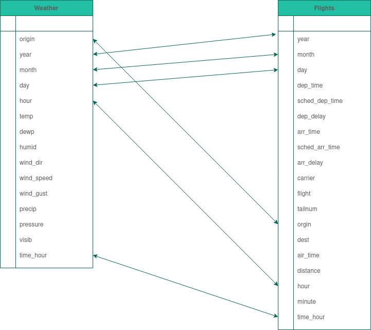
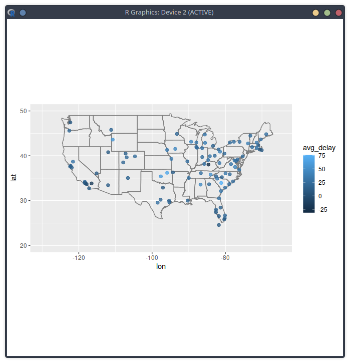

# Section 12.3.3 

## 1 Why are pivot_longer() and pivot_wider() not perfectly symmetrical? Carefully consider the following example

```R
stocks <- tibble(
  year   = c(2015, 2015, 2016, 2016),
  half  = c(   1,    2,     1,    2),
  return = c(1.88, 0.59, 0.92, 0.17)
)
stocks %>% 
  pivot_wider(names_from = year, values_from = return) %>% 
  pivot_longer(`2015`:`2016`, names_to = "year", values_to = "return")
```

The functions `pivot_longer()` and `pivot_wider()` are not perfectly symmetrical because column type information is lost. When we use `pivot_wider()` on a data frame, it discards the original column types. It has to coerce all the variables into a single vector with a single type. Later, if we `pivot_longer()` that data frame, the `pivot_longer()` function does not know the original data types of the variables. I found this answer [here](https://rpubs.com/uky994/584664).

## 2 Why does this code fail?

``` R
table4a %>% 
  pivot_longer(c(1999, 2000), names_to = "year", values_to = "cases")
#> Error: Can't subset columns that don't exist.
#> [31m✖[39m Locations 1999 and 2000 don't exist.
#> [34mℹ[39m There are only 3 columns.
```

Because 1999 and 2000 are labled as column headers they must be interpreted as strings

``` R
table4a %>% 
  pivot_longer(c('1999', '2000'), names_to = "year", values_to = "cases")
```


# Section 12.4.3 

## 1 What do the extra and fill arguments do in separate()? Experiment with the various options for the following two toy datasets.

``` R
tibble(x = c("a,b,c", "d,e,f,g", "h,i,j")) %>% 
  separate(x, c("one", "two", "three"))

tibble(x = c("a,b,c", "d,e", "f,g,i")) %>% 
  separate(x, c("one", "two", "three"))
```

### Extra

Provides some extra instructions on what to do with `extra` data, 

#### Warn

provides a warning message about dropped information

#### Merge

does it best to make sure that all items can fit into the data set by combining entires

#### Drop 

Removes anything that doesn't fit into the separate

### Fill

#### Warn

retives a warning message if the data is not the correct fit just like it does above

#### Right

#### Left

## 2 Both unite() and separate() have a remove argument. What does it do? Why would you set it to FALSE

The remove argument discards input columns in the result data frame. You would set it to FALSE if you want to create a new variable, but keep the old one.

# Section 12.6.1 

## 3 I claimed that iso2 and iso3 were redundant with country. Confirm this claim.

`iso2` and `iso3` work as country codes / abbreviations of the actual country, thus they display the same information as the `country` col

# Section 13.2.1: 

## 2 I forgot to draw the relationship between weather and airports. What is the relationship and how should it appear in the diagram?

### Weather

```R
[1] "origin"     "year"       "month"      "day"        "hour"      
[6] "temp"       "dewp"       "humid"      "wind_dir"   "wind_speed"
[11] "wind_gust"  "precip"     "pressure"   "visib"      "time_hour"
```

### Flights

```R
[1] "year"           "month"          "day"            "dep_time"      
[5] "sched_dep_time" "dep_delay"      "arr_time"       "sched_arr_time"
[9] "arr_delay"      "carrier"        "flight"         "tailnum"       
[13] "origin"         "dest"           "air_time"       "distance"      
[17] "hour"           "minute"         "time_hour" 
```

So we can make an image that kinda looks like the following



## 4 We know that some days of the year are “special”, and fewer people than usual fly on them. How might you represent that data as a data frame? What would be the primary keys of that table? How would it connect to the existing tables?

In a perfect world I could just make the `PK` something like a datepart that used month-day and it would reference back to month and date keys in the larger datasets 

# Section 13.4.6: 

## 1 Compute the average delay by destination, then join on the airports data frame so you can show the spatial distribution of delays. Here’s an easy way to draw a map of the United States:

```R 
airports %>%
  semi_join(flights, c("faa" = "dest")) %>%
  ggplot(aes(lon, lat)) +
    borders("state") +
    geom_point() +
    coord_quickmap()
```

``` R
flights %>%
  mutate(tot_delay = arr_delay + dep_delay) %>%
  group_by(dest) %>%
  summarize(avg_delay = mean(tot_delay, na.rm = TRUE)) %>%
  left_join(select(airports, faa, lon, lat), c("dest" = "faa")) %>%
  ggplot(aes(lon, lat, colour = avg_delay)) +
  borders("state") +
  geom_point(size = 2, alpha = 0.8) +
  xlim(c(-130, -65)) +
  ylim(c(20, 50)) +
  coord_quickmap()
```



You might want to use the `size` or `colour` of the points to display the average delay for each airport.

## 3 Is there a relationship between the age of a plane and its delays?

# Section 13.5.1: 

## 2 Filter flights to only show flights with planes that have flown at least 100 flights.