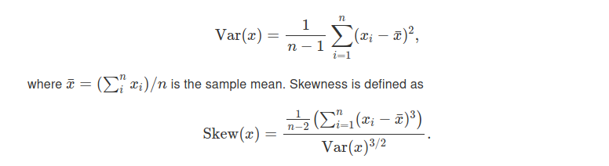

# Jake Gadaleta | Homework 5
## Section 20.3.5: # 3

### 3. A logical vector can take 3 possible values. How many possible values can an integer vector take? How many possible values can a double take? Use google to do some research.

info found on [stack_overflow](https://stackoverflow.com/questions/18507920/largest-possible-values-in-r)

#### Integers

```R
> .Machine$integer.max
[1] 2147483647
```

that means we have to double that number when accounting for the negatives, there are no options to set `.Machine$integer.min` 

#### Doubles 

```R
> .Machine$double.xmax
[1] 1.797693e+308
```

again double that to account for negatives. 
There are no options to set `.Machine$double.min` or `.Machine$double.xmin` 
<div style="page-break-after: always;"></div>

## Section 20.4.6: # 5 , 6

### 5. Why is x[-which(x > 0)] not the same as x[x <= 0]?

the first checks to see if what is not > 0 so it just takes the inverse, so its two steps

the seconds completes in one step

### 6. What happens when you subset with a positive integer that’s bigger than the length of the vector? What happens when you subset with a name that doesn’t exist?

the rest of the data will fill with N/A's

```R

> c(1,2,3)[2:5]
[1] 2 3 NA NA
```
<div style="page-break-after: always;"></div>

## Section 21.2.1: # 1 , 2
### 1.Write for loops to:    
1. Compute the mean of every column in mtcars.

```R
for (i in colnames(mtcars)){
    print(mean(mtcars[[i]]))
}
```

2. Determine the type of each column in nycflights13::flights.

```R
library(nycflights13)
for (i in colnames(flights)){
    print(typeof(flights[[i]]))
}
```

3. Compute the number of unique values in each column of iris.

```R
for (i in colnames(iris)){
    print(length(unique(iris[[i]])))
}
```

4. Generate 10 random normals from distributions with means of -10, 0, 10, and 100.

```R
for (i in c(-10, 0, 10, 100)){
    print(rnorm(10, i))
}
```


### 2. Eliminate the for loop in each of the following examples by taking advantage of an existing function that works with vectors:

```R
# 1
out <- ""
for (x in letters) {
  out <- stringr::str_c(out, x)
}

# 2
x <- sample(100)
sd <- 0
for (i in seq_along(x)) {
  sd <- sd + (x[i] - mean(x)) ^ 2
}
sd <- sqrt(sd / (length(x) - 1))

# 3
x <- runif(100)
out <- vector("numeric", length(x))
out[1] <- x[1]
for (i in 2:length(x)) {
  out[i] <- out[i - 1] + x[i]
}
```

```R
# 1
out <- ""
out <- paste(out, letters)


#2
x <- sample(100)
sd <- sd(x)

#3

```
## Section 21.5.3: # 1 , 4

### 1. Write for maps to:    
1. Compute the mean of every column in mtcars.

```R
map(mtcars, mean)
```

2. Determine the type of each column in nycflights13::flights.

```R
map(flights, typeof)
```

3. Compute the number of unique values in each column of iris.

```R
x <- function(x){
    return(length(unique(x)))
}

map(iris, x)
```

4. Generate 10 random normals from distributions with means of -10, 0, 10, and 100.

```R
map(c(-10,0,10,100), rnorm, n=10)
```

### 4. What does map(-2:2, rnorm, n = 5) do? Why? What does map_dbl(-2:2, rnorm, n = 5) do? Why?

working backwards `n` is the size it represents the n in `rnorm`, 
`rnorm` will get into the map and use it to generate a normal distribution
`-2:2` is the mean value for `rnorm`, in this case its values between -2, -1, 0, 1, 2

`map_dbl` enforces the numbers to be doubles where as `map` uses the generic number type

<div style="page-break-after: always;"></div>

## Section 19.2.1: # 4

### 4. write your own functions to compute the variance and skewness of a numeric vector. Variance is defined as 



```R
variance <- function(n, x){
    sum <- 0

    for(i in x){
        sum<- sum + (i - mean(x))
    }

    return(
        1/(n-1) * (sum * sum)
    )
}

skew <- function(n, x){
    sum <- 0

    for(i in x){
        sum<- sum + (i - mean(x))
    }

    return(
        ((1/(n-2)) * (sum * sum * sum)) / variance(n,x)
    )
}
```
<div style="page-break-after: always;"></div>

## Section 19.4.4: # 3 

### 3. Implement a fizzbuzz function. It takes a single number as input. If the number is divisible by three, it returns “fizz”. If it’s divisible by five it returns “buzz”. If it’s divisible by three and five, it returns “fizzbuzz”. Otherwise, it returns the number. Make sure you first write working code before you create the function.

```R
fizzbuzz <- function(x){
    if(x%%3 == 0 && x%%5 == 0){
        return("FIZZBUZZ")
    }
    else if (x%%3 == 0) {
       return("FIZZ")
    }
    else if (x%%5 == 0){
        return("BUZZ")
    }
}
```