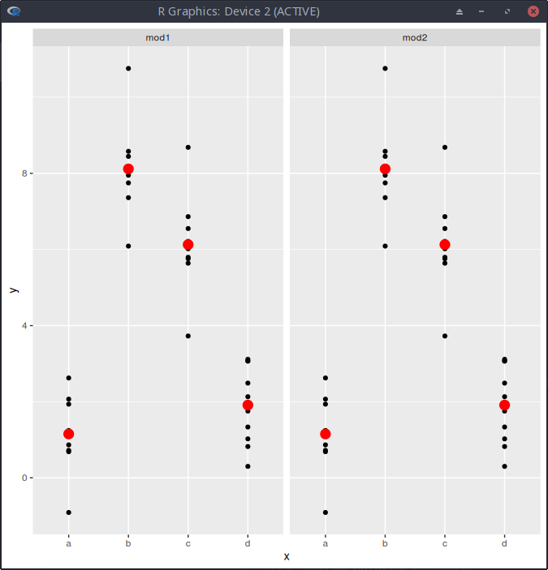

# Jake Gadaleta | Block 7 Check

## Section 23.2.1: # 1

### One downside of the linear model is that it is sensitive to unusual values because the distance incorporates a squared term. Fit a linear model to the simulated data below, and visualise the results. Rerun a few times to generate different simulated datasets. What do you notice about the model?

```R
library(tidyverse)
library(modelr)

sim1a <- tibble(
  x = rep(1:10, each = 3),
  y = x * 1.5 + 6 + rt(length(x), df = 2)
)

gen_model <- function(regression, title){
    pdf(paste(title, ".pdf"))
    
    grid <- sim1a %>%
    data_grid(x) %>%
    add_predictions(regression)

    print(
        ggplot(sim1a, aes(x)) + 
        geom_point(aes(y=y)) +
        geom_point(data = grid, aes(y=pred), color="blue")
    )

    sim1a <- sim1a %>%
    add_residuals(regression)

    print(
        ggplot(sim1a, aes(resid)) +
        geom_freqpoly(binwidth=0.5)
    )
    
    print(
        ggplot(sim1a, aes(x,resid)) +
        geom_point() +
        geom_ref_line(h=0)
    )
    
    dev.off()
}


gen_model(lm(y ~ x, data=sim1a), "1") 
gen_model(lm(y ~ I(x^2), sim1a), "2")
gen_model(lm(log(y) ~ sqrt(x) - 1, sim1a), "3")
gen_model(lm(y ~ I(x^2) + x - 1, sim1a), "4")

```

I tackled this the only way that I know how and that was just the program the hell out of it. using a simple function I took the basic setup that we used in class and just looped through each one from 11-10 and saved each to it's own pdf file I then just took like 3 seconds to look through to find which version allowed us to have the best fit.

```R
gen_model(lm(y ~ x, data=sim1a), "1") 
gen_model(lm(y ~ I(x^2), sim1a), "2")
gen_model(lm(log(y) ~ sqrt(x) - 1, sim1a), "3")
gen_model(lm(y ~ I(x^2) + x - 1, sim1a), "4")
```

### 1

While the intaial model for 1 looks good when checked against the residuls it does raise the question while not being super predicatable it could definatly be better

### 2

2 looks a lot like one except for the fact that I like the resudials a lot more

### 3 

3 is just bad in general that model doesn't even come close to properly fitting

### 4

4 looks pretty good but not as favored as 2

In th ened I belive that 2 is the best that we can get given these formulas


## Section 23.3.3: # 1 2    

### Instead of using `lm()` to fit a straight line, you can use `loess()` to fit a smooth curve. Repeat the process of model fitting, grid generation, predictions, and visualisation on sim1 using `loess()` instead of `lm()`. How does the result compare to `geom_smooth()`?

I simply retro fitted the function and ran all types of regression (also I gridded it oooo fancy) and found that it was very similar to the orginal please refer attached pdf's to view

### add_predictions() is paired with gather_predictions() and spread_predictions(). How do these three functions differ?

The function add_predictions() adds only a single model at a time.

The function gather_predictions() adds predictions from multiple models by stacking the results and adding a column with the model name.

The function spread_predictions() adds predictions from multiple models by adding multiple columns (postfixed with the model name) with predictions from each model.

## Section 23.4.5: # 1 , 4

### What happens if you repeat the analysis of sim2 using a model without an intercept. What happens to the model equation? What happens to the predictions?

```R
mod1 <- lm(y~x - 1, data = sim2)
mod2 <- lm(y~x, data = sim2)
mod1$coefficients
```

```R
mod2$coefficients
## (Intercept)          xb          xc          xd 
##   1.1521664   6.9638728   4.9750241   0.7588142

grid1 <- sim2 %>% 
  data_grid(x)%>%
  gather_predictions(mod1,mod2)
```

thus we find the best fit to look like this

```R
sim2 %>%
  ggplot(aes(x))+
  geom_point(aes(y=y))+
  geom_point(data = grid1, aes(y = pred),color = "red",size = 4)+
  facet_grid(~model)
```




### Use model_matrix() to explore the equations generated for the models I fit to sim3 and sim4. Why is * a good shorthand for interaction?

```R
model_matrix(data = sim3, y ~ x1 + x2)

## # A tibble: 120 x 5
##    `(Intercept)`    x1   x2b   x2c   x2d
##            <dbl> <dbl> <dbl> <dbl> <dbl>
##  1             1     1     0     0     0
##  2             1     1     0     0     0
##  3             1     1     0     0     0
##  4             1     1     1     0     0
##  5             1     1     1     0     0


model_matrix(data = sim3, y ~ x1 * x2)

## # A tibble: 120 x 8
##    `(Intercept)`    x1   x2b   x2c   x2d `x1:x2b` `x1:x2c` `x1:x2d`
##            <dbl> <dbl> <dbl> <dbl> <dbl>    <dbl>    <dbl>    <dbl>
##  1             1     1     0     0     0        0        0        0
##  2             1     1     0     0     0        0        0        0
##  3             1     1     0     0     0        0        0        0
##  4             1     1     1     0     0        1        0        0
##  5             1     1     1     0     0        1        0        0

model_matrix(data = sim4, y ~ x1 + x2)

## # A tibble: 300 x 3
##    `(Intercept)`    x1         x2
##            <dbl> <dbl>      <dbl>
##  1             1    -1 -1.0000000
##  2             1    -1 -1.0000000
##  3             1    -1 -1.0000000
##  4             1    -1 -0.7777778
##  5             1    -1 -0.7777778

model_matrix(data = sim4, y ~ x1 * x2)

## # A tibble: 300 x 4
##    `(Intercept)`    x1         x2   `x1:x2`
##            <dbl> <dbl>      <dbl>     <dbl>
##  1             1    -1 -1.0000000 1.0000000
##  2             1    -1 -1.0000000 1.0000000
##  3             1    -1 -1.0000000 1.0000000
##  4             1    -1 -0.7777778 0.7777778
##  5             1    -1 -0.7777778 0.7777778
```

`*` is good because 1. It is simple and efficient to treat categorical predictors, which is tedious to do using `+`. Or even impossible? 2. It is simple to create interaction term for continuous varaibles too.
